# EXPERIMENT – 1  
## Comparison of Virtual Machines (VMs) and Containers using Ubuntu and Nginx

---

## Aim

To study, implement, and compare Virtual Machines (VMs) and Containers by deploying an Ubuntu-based Nginx web server in both environments and analyzing their resource utilization, performance, and operational characteristics.

---

## Objectives

- To understand the conceptual difference between Virtual Machines and Containers  
- To install and configure a Virtual Machine using VirtualBox and Vagrant  
- To install and configure Containers using Docker inside WSL  
- To deploy Nginx web server on both VM and Container  
- To compare performance, startup time, and resource usage of VMs and Containers  

---

## System Requirements

### Hardware Requirements
- 64-bit system with virtualization enabled in BIOS  
- Minimum 8 GB RAM (4 GB acceptable)  
- Stable internet connection  

### Software Requirements (Windows Host)
- Oracle VirtualBox  
- Vagrant  
- Windows Subsystem for Linux (WSL 2)  
- Ubuntu (WSL distribution)  
- Docker Engine (Docker CLI)  

---

# Theory

## Virtual Machine (VM)

A Virtual Machine emulates a complete physical computer, including its own operating system, kernel, libraries, and hardware drivers. Each VM runs on top of a hypervisor such as VirtualBox.

### Characteristics:
- Full OS per VM  
- Strong isolation  
- High resource usage  
- Slower startup time  

---

## Container

Containers virtualize at the operating system level. They share the host OS kernel while isolating applications and dependencies in user space.

### Characteristics:
- Shared kernel  
- Lightweight  
- Fast startup  
- Efficient resource utilization  

---

# Experiment Setup

---

# PART A: Virtual Machine Setup (Using VirtualBox & Vagrant)

---

## Step 1: Install VirtualBox

Download from:

https://www.virtualbox.org

Install using default settings and restart if prompted.

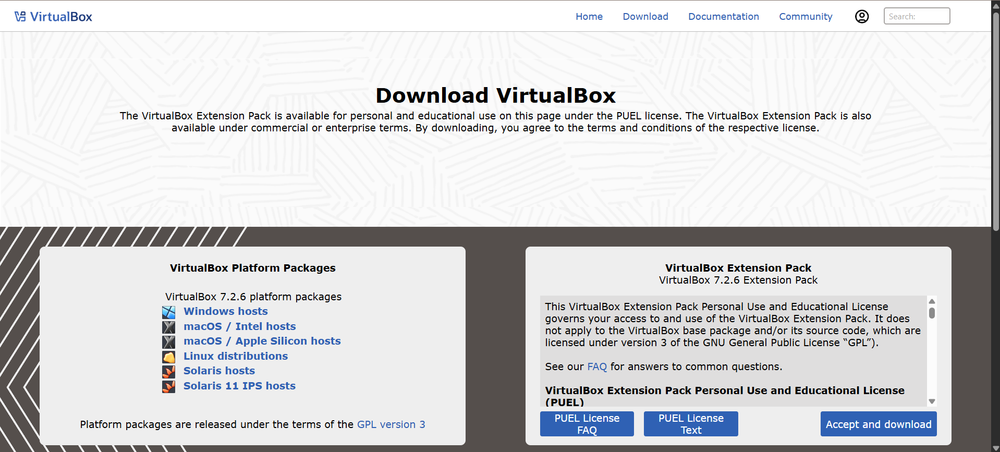

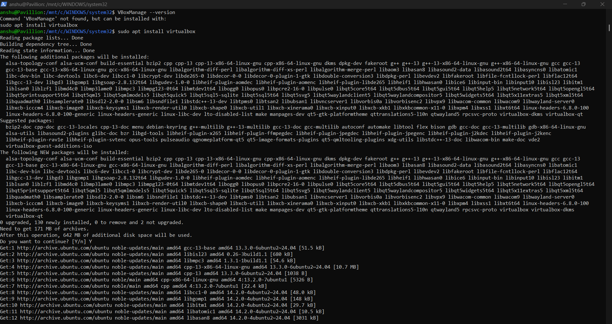


---

## Step 2: Install Vagrant

Download and install Vagrant.

Verify installation:

```powershell
vagrant --version
```

Example Output:

```powershell
Vagrant 2.4.9
```

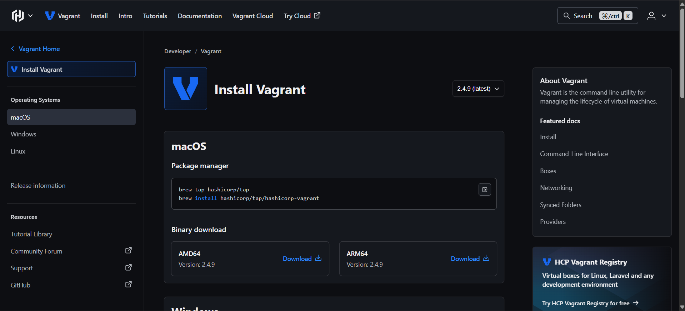

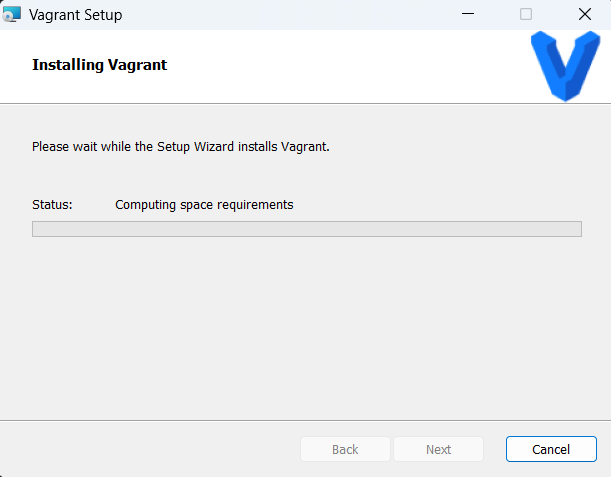

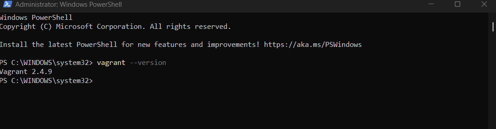


---

## Step 3: Create Ubuntu VM using Vagrant

Create new directory:

```powershell
mkdir vm-lab
cd vm-lab
```

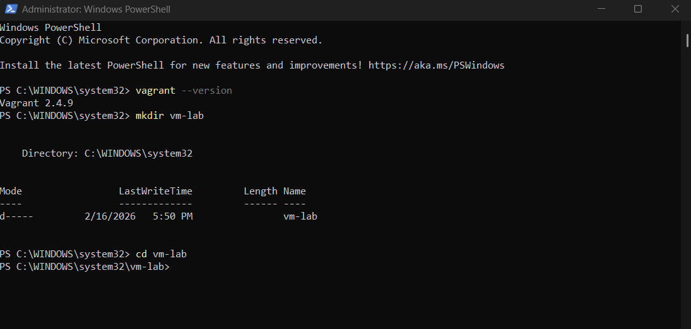


Initialize Ubuntu box:

```powershell
vagrant init ubuntu/jammy64
```

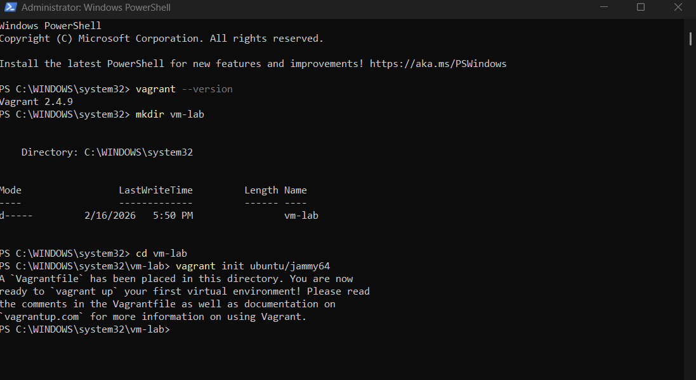


Start Virtual Machine:

```powershell
vagrant up
```

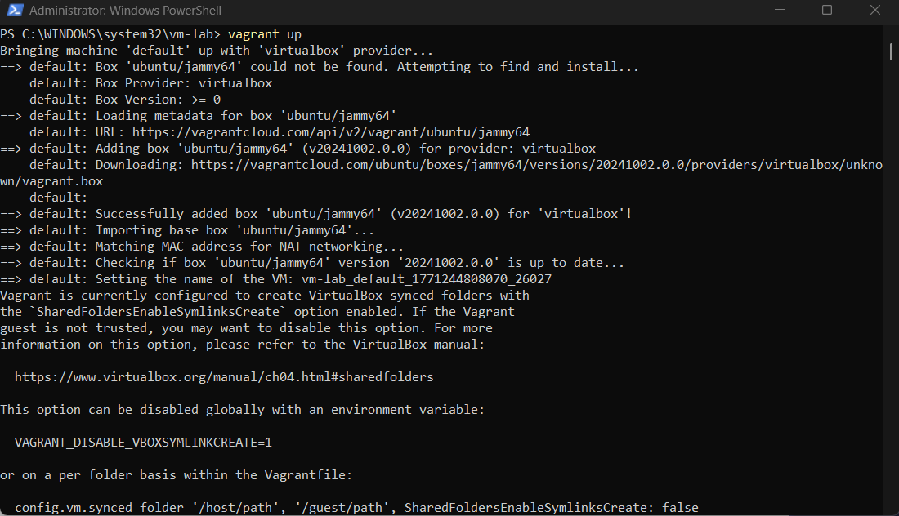


Access VM:

```powershell
vagrant ssh
```

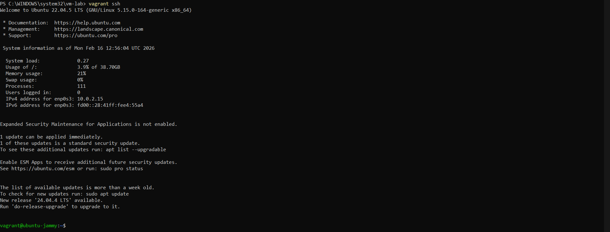


---

## Step 4: Install Nginx inside VM

```bash
sudo apt update
sudo apt install -y nginx
sudo systemctl start nginx
```

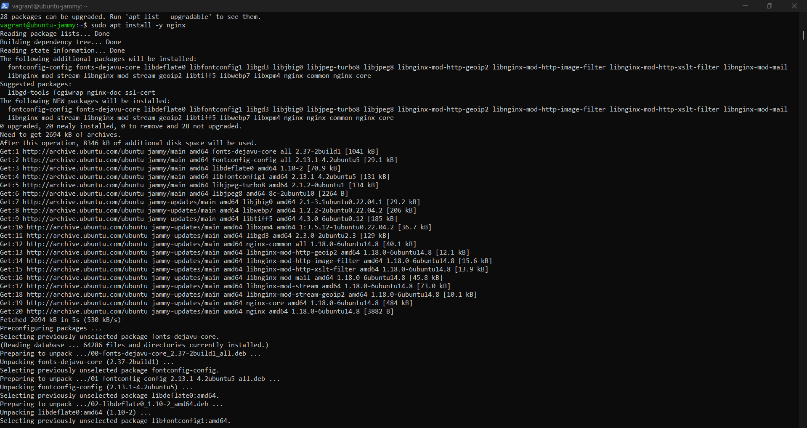


---

## Step 5: Verify Nginx in VM

```bash
curl localhost
```

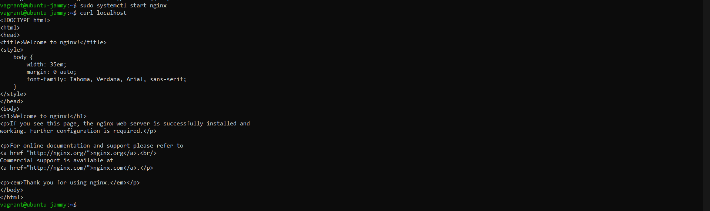


If Nginx default HTML page appears, deployment is successful.

---

## Step 6: Stop and Remove VM

```powershell
vagrant halt
vagrant destroy
```

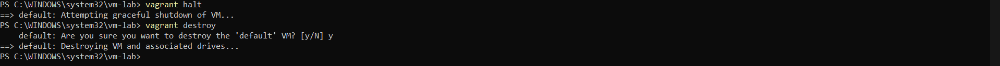


---

# PART B: Container Setup using Docker inside WSL

---

## Step 1: Install WSL

```powershell
wsl --install
```

Reboot system.

---

## Step 2: Install Ubuntu on WSL

```powershell
wsl --install -d Ubuntu
```

---

## Step 3: Install Docker Engine inside WSL

```bash
sudo apt update
sudo apt install -y docker.io
sudo systemctl start docker
sudo usermod -aG docker $USER
```

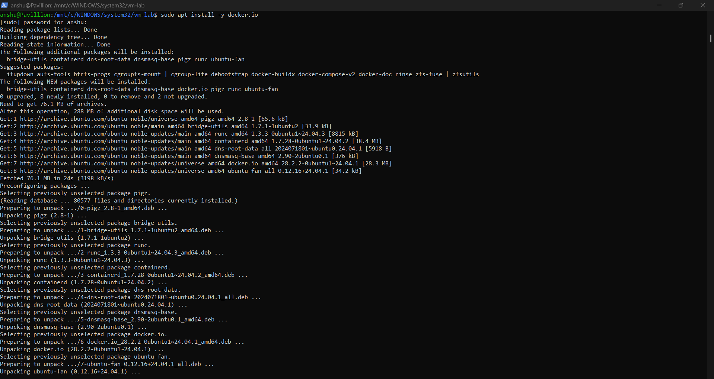


Logout and login again to apply group changes.

---

## Step 4: Run Nginx Container

Pull Nginx image:

```bash
docker pull nginx
```

Run container:

```bash
docker run -d -p 8080:80 --name nginx-container nginx
```

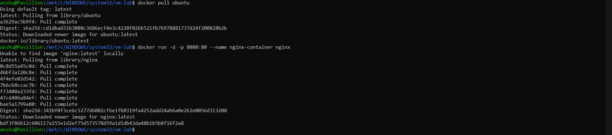


Check running containers:

```bash
docker ps
```

---

## Step 5: Verify Nginx Container

```bash
curl localhost:8080
```

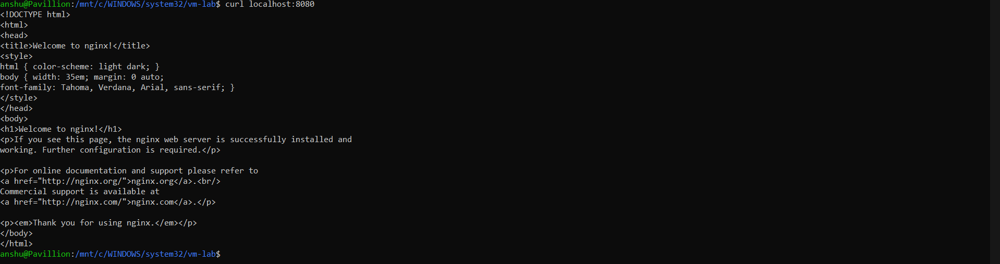


If Nginx default page appears, container deployment is successful.

---

# Resource Utilization Observation

## VM Observation Commands

```bash
free -h
htop
systemd-analyze
```

## Container Observation Commands

```bash
docker stats
free -h
```

---

# Common Troubleshooting

## VirtualBox Issues
- VT-x / AMD-V not enabled → Enable virtualization in BIOS  
- Hyper-V conflict → Disable Hyper-V in Windows  

## Vagrant Issues
- Box download failure → Check firewall  
- SSH timeout → Run `vagrant reload`  

## Docker Issues (WSL)
- Permission denied → Ensure user added to docker group  
- Docker service not running:

```bash
sudo systemctl start docker
```

---

# Result

The experiment successfully demonstrated that containers are lightweight, faster, and more resource-efficient than virtual machines, while virtual machines provide stronger isolation and full OS abstraction.

---

# Conclusion

Containers are best suited for modern cloud-native and DevOps workflows due to their speed and efficiency, whereas Virtual Machines are preferred when full isolation and OS-level control are required.

---

# Viva-Voice Questions

1. What is the main difference between VM and container?  
2. Why do containers start faster than VMs?  
3. What role does a hypervisor play?  
4. Can containers run different OS kernels?  
5. Why is Docker considered lightweight?  

---

# References

- VirtualBox Documentation  
- Vagrant Documentation  
- Docker Official Documentation  
