# EXPERIMENT – 3  
## Deploying NGINX Web Server Using Official, Ubuntu, and Alpine Base Images and Comparing Image Layers

---

## Aim

To deploy the NGINX web server using different Docker base images and compare their image size, performance, layers, and security impact.

---

## Objectives

After completing this experiment, students will be able to:

- Deploy NGINX using Docker containers  
- Build custom images using Dockerfile  
- Understand Docker image layers  
- Compare Ubuntu, Alpine, and Official images  
- Analyze size, speed, and security differences  
- Explain real-world uses of NGINX in containers  

---

## Prerequisites

- Docker installed and running  
- Basic Linux commands  
- Knowledge of:
  - `docker pull`
  - `docker run`
  - `docker build`
  - Dockerfile
  - Port mapping  

---

# Theory

## What is NGINX?

NGINX is a high-performance:

- Web Server  
- Reverse Proxy  
- Load Balancer  
- API Gateway  

It uses an event-driven asynchronous architecture, making it faster and more scalable than traditional servers like Apache.

---

## What is Docker?

Docker is a containerization platform that:

- Packages applications with dependencies  
- Ensures portability  
- Provides lightweight virtualization  
- Speeds up deployment  

---

## What are Docker Image Layers?

Docker images are built in layers.

Each instruction in a Dockerfile creates a layer:

- `FROM`
- `RUN`
- `COPY`
- `ADD`

### Importance of Layers

- More layers → Bigger image  
- Bigger images → Slower pull time  
- Larger images → More vulnerabilities  
- Fewer layers → Faster and more secure  

---

## Base Image Types

| Base Image | Description |
|------------|------------|
| Official nginx | Pre-built optimized production image |
| Ubuntu | Full Linux OS with tools |
| Alpine | Lightweight minimal Linux |

---

# Experiment Procedure

---

# Part 1 — Deploy NGINX Using Official Image

### Step 1: Pull Image

```bash
docker pull nginx:latest
```

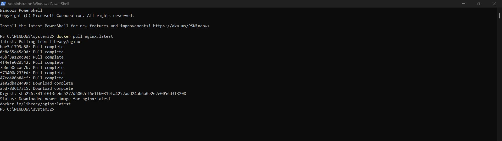


### Step 2: Run Container

```bash
docker run -d --name nginx-official -p 8080:80 nginx
```

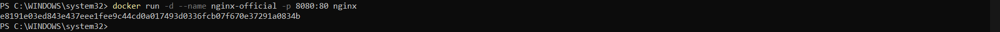


### Step 3: Verify

```bash
curl http://localhost:8080
```


OR open in browser:

```
http://localhost:8080
```

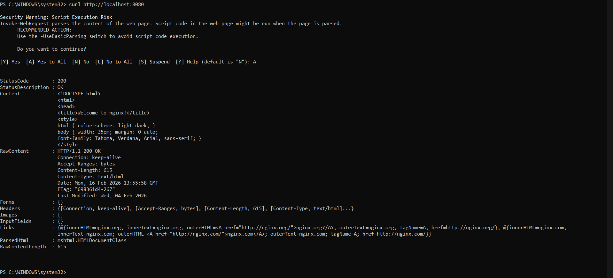


### Observations

```bash
docker images nginx
```

- Pre-optimized  
- Production ready  
- Medium size (~140MB)  

---

# Part 2 — Custom NGINX Using Ubuntu Base Image

### Step 1: Create Dockerfile

Create a file named `Dockerfile`:

```dockerfile
FROM ubuntu:22.04

RUN apt-get update && \
    apt-get install -y nginx && \
    apt-get clean && \
    rm -rf /var/lib/apt/lists/*

EXPOSE 80

CMD ["nginx", "-g", "daemon off;"]
```

### Step 2: Build Image

```bash
docker build -t nginx-ubuntu .
```

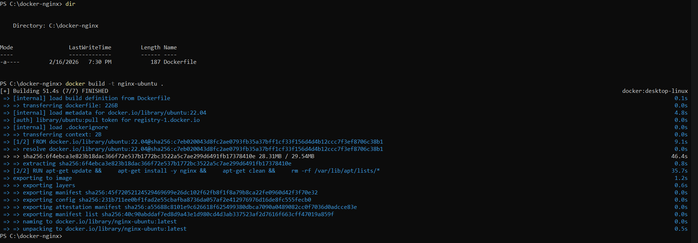


### Step 3: Run Container

```bash
docker run -d --name nginx-ubuntu -p 8081:80 nginx-ubuntu
```

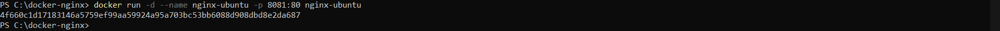


### Observations

```bash
docker images nginx-ubuntu
```

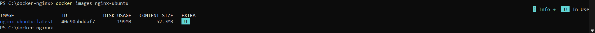


- Large image (~220MB+)  
- Many layers  
- Includes full OS  
- Slower startup  
- Larger attack surface  

---

# Part 3 — Custom NGINX Using Alpine Base Image

### Step 1: Create Dockerfile

```dockerfile
FROM alpine:latest

RUN apk add --no-cache nginx

EXPOSE 80

CMD ["nginx", "-g", "daemon off;"]
```

### Step 2: Build Image

```bash
docker build -t nginx-alpine .
```

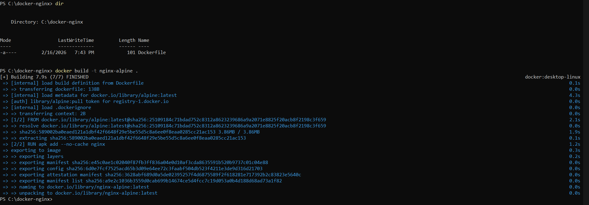


### Step 3: Run Container

```bash
docker run -d --name nginx-alpine -p 8082:80 nginx-alpine
```

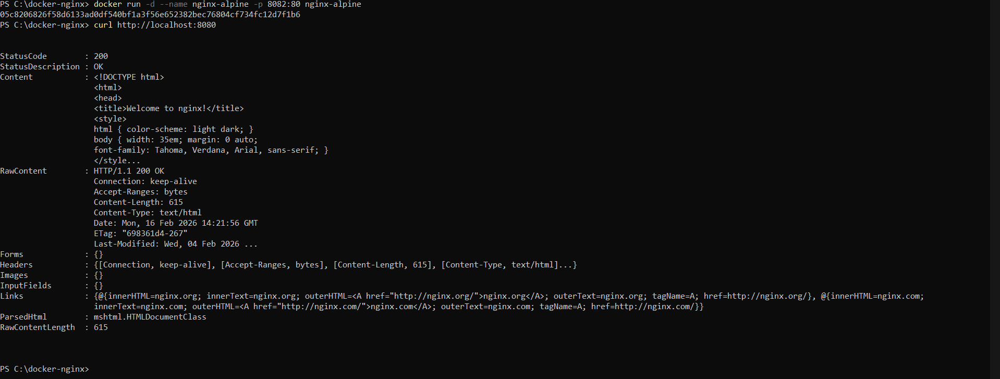


### Observations

```bash
docker images nginx-alpine
```

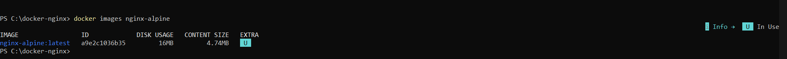


- Very small (~25–30MB)  
- Minimal dependencies  
- Faster pull time  
- Faster startup  
- More secure  

---

# Part 4 — Compare Image Sizes

```bash
docker images | grep nginx
```

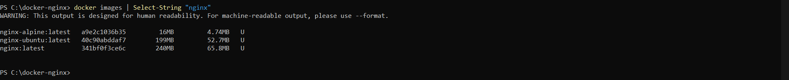


### Sample Output

| Image Type | Size |
|------------|------|
| nginx:latest | ~140MB |
| nginx-ubuntu | ~220MB+ |
| nginx-alpine | ~25MB |

---

# Part 5 — Inspect Image Layers

```bash
docker history nginx
docker history nginx-ubuntu
docker history nginx-alpine
```

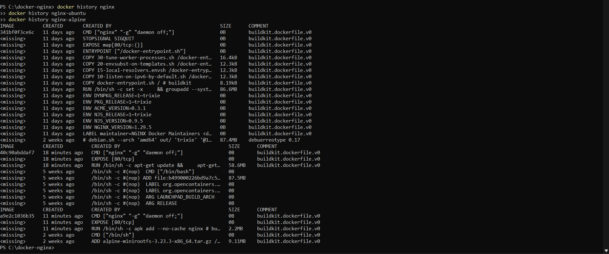


### Observations

- Ubuntu → Many filesystem layers  
- Alpine → Minimal layers  
- Official → Optimized layers  

---

# Part 6 — Serve Custom HTML Page

### Step 1: Create HTML

```bash
mkdir html
echo "<h1>Hello from Docker NGINX</h1>" > html/index.html
```

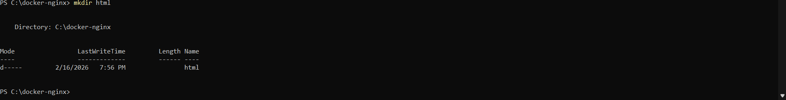


### Step 2: Run

```bash
docker run -d \
  -p 8083:80 \
  -v $(pwd)/html:/usr/share/nginx/html \
  nginx
```

### Step 3: Verify

Open:

```
http://localhost:8083
```

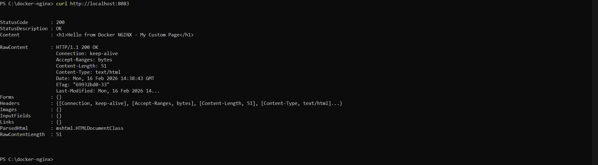


---

# Part 7 — Real World Uses of NGINX

NGINX is commonly used for:

- Static websites  
- Reverse proxy  
- Load balancing  
- SSL termination  
- API gateway  
- Kubernetes ingress controller  
- Microservices frontend  

---

# Comparison Summary

| Feature | Official | Ubuntu | Alpine |
|----------|----------|---------|---------|
| Size | Medium | Large | Very Small |
| Startup | Fast | Slow | Very Fast |
| Security | Medium | Low | High |
| Debugging | Limited | Good | Minimal |
| Production | Yes | Rare | Yes |

---

# When to Use What

### Official Image
- Production deployments  
- Reverse proxy  
- Standard hosting  

### Ubuntu Image
- Learning purposes  
- Debugging tools required  
- Heavy dependencies  

### Alpine Image
- Cloud environments  
- Microservices  
- CI/CD  
- Kubernetes  

---

# Assignment Tasks

- Measure image pull time  
- Add custom NGINX configuration  
- Change default port  
- Enable basic authentication  
- Reduce layers and rebuild  

Explain:

- Why Alpine is smaller  
- Why Ubuntu is not preferred in production  

---

# Viva Questions

1. What is NGINX?  
2. What is Docker?  
3. What are Docker layers?  
4. Why are Alpine images smaller?  
5. Difference between Ubuntu and Alpine?  
6. Why use official images in production?  
7. What is reverse proxy?  
8. How does NGINX improve performance?  

---

# Learning Outcomes

After completing this experiment, students can:

- Deploy web servers in containers  
- Build custom Docker images  
- Optimize image size  
- Understand layer structure  
- Improve security practices  
- Use NGINX in production systems  

---

# Conclusion

This experiment demonstrates that:

- Official images are stable and production ready  
- Ubuntu images are large and slower  
- Alpine images are lightweight, faster, and secure  

Therefore, Alpine or Official images are preferred for real-world deployments.

